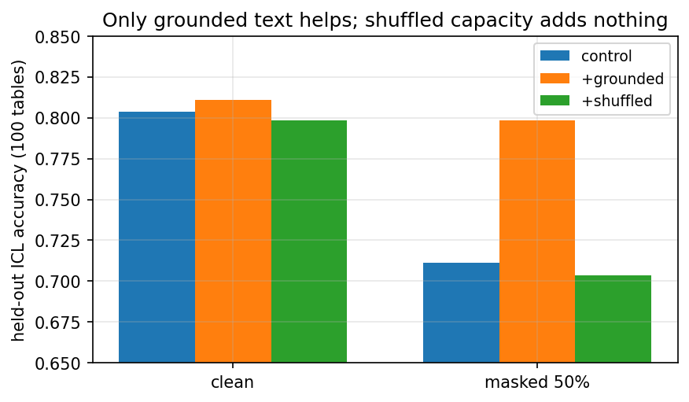

# Coherent Synthetic Text as a Fallback Channel for Tabular Foundation Models

Tabular FMs pretrain on numeric-only synthetic priors, yet real tables are
full of text. This repo augments the **TabICL-v2 prior with coherent,
row-grounded text fields** and pretrains **nano TFMs with a frozen text
encoder + learned projector** — using zero real text.



**Headline (500 tables, 100 held-out, reproduced with checkpoints):**
clean 0.804 → **0.811** (+0.007), 50%-masked 0.711 → **0.798** (+0.087).
A shuffled-text control with identical capacity adds nothing — the gain is
grounding, not parameters. Full story: [`paper/draft.md`](paper/draft.md).

## Layout
- `tfm3_text/` — generator, frozen encoder, fusion, eval (torch + sklearn only)
- `scripts/` — smoke test, pretraining, paraphrasing, benchmarks
  (STRABLE / OpenML / CARTE / Hub text-heavy tables)
- `upstream/TFM-Playground/` — reference harness (unmodified clone)
- `paper/` — draft + figures (`figures.py` regenerates them)
- `results/` — frozen result JSONs
- `configs/base.yaml`, `requirements_text.txt`

## Quickstart
```bash
pip install -r requirements_text.txt
python scripts/smoke_text.py
```

See [`README_TFM3.md`](README_TFM3.md) for design decisions, full findings,
and the benchmark tables. Reference: TabICLv2 (arXiv:2602.11139),
TFM-Playground (automl/TFM-Playground), STRABLE, CARTE.
